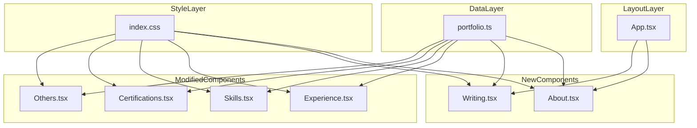
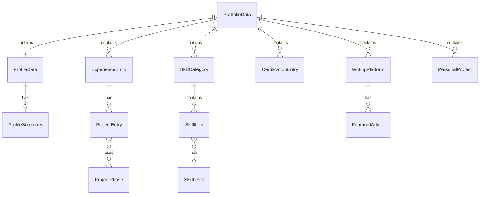

# Design Document: portfolio-content-enhancement

## Overview

本機能は、Data Engineer 向井雄二の個人ポートフォリオサイト（GitHub Pages）に対して、採用担当者・クライアントが必要とするコンテンツ要素を追加・拡充する。現状の実装は 7 つのセクションコンポーネント（Profile、Experience、Skills、Certifications、Talks、Others および Header）を持つが、自己紹介文・プロジェクト詳細・スキル習熟度・資格メタ情報・技術記事・個人開発プロジェクトの各情報が不足している。

**Purpose**: 訪問者がエンジニアの実力・人物像を迅速に把握できるよう、コンテンツ密度と情報構造を改善する。
**Users**: 採用担当者・クライアントは職務適性評価に、コミュニティメンバーは技術発信活動の把握に利用する。
**Impact**: `src/data/portfolio.ts` のデータ型を拡張し、新規 2 コンポーネント（About、Writing）の追加と既存 4 コンポーネント（Experience、Skills、Certifications、Others）の改修を行う。

### Goals

- 自己紹介・キャリアサマリーセクションをプロフィール直下に追加する
- 各プロジェクトに技術スタック・担当フェーズ・成果指標フィールドを付与する
- スキル一覧に習熟度レベルと実務年数を付与する
- 資格情報に取得日・有効期限・学習中フラグを付与する
- 技術記事（Qiita / Zenn）の発信活動を新セクションで表示する
- 個人開発・OSS プロジェクトを独立したセクションで表示する（データ未定義時は非表示）
- すべての新規フィールドを TypeScript の strict 型で定義する

### Non-Goals

- バックエンド API や動的データフェッチの導入（静的サイトの性質を維持する）
- 外部プラットフォーム（Qiita / Zenn）からのリアルタイム記事取得
- ユーザー認証・コメント機能
- 多言語対応（i18n）
- テスト自動化の導入（現行プロジェクトの方針に従い手動検証のみ）

---

## Architecture

### Existing Architecture Analysis

現状の実装は以下のパターンで成立している。

- **データ層**: `src/data/portfolio.ts` が PortfolioData 型定数を単一ソース・オブ・トゥルースとして保持する
- **コンポーネント層**: 各セクションコンポーネントが portfolio を直接インポートし、props なしで自己完結して描画する
- **スタイリング**: CSS カスタムプロパティ（`--bg-primary` / `--accent` 等）と再利用可能 CSS ユーティリティクラス（`.card` / `.tag` / `.btn-ghost` 等）を `src/index.css` で一元管理する
- **新セクション追加パターン**: `portfolio.ts` にデータ追加 → コンポーネント作成 → `App.tsx` に挿入という確立されたパターンが存在する

本機能はこのパターンをそのまま踏襲し、アーキテクチャ変更は行わない。

### Architecture Pattern & Boundary Map



**Architecture Integration**:
- 選択パターン: Component-per-Section（既存踏襲）
- ドメイン境界: データ層とコンポーネント層の分離を維持。新フィールドはすべて `portfolio.ts` に集約
- 新規コンポーネント: `About.tsx`（要件 1）、`Writing.tsx`（要件 5）
- Steering 準拠: データ単一ソース原則・外部リンクへの `target="_blank" rel="noopener noreferrer"` 付与・ダークターミナルデザイン継続

### Technology Stack

| Layer | Choice / Version | Role in Feature | Notes |
|-------|-----------------|-----------------|-------|
| Language | TypeScript ~6.0.2 | 新規インターフェース定義・型安全性強制 | strict モード有効 |
| UI Framework | React 19 | 新規・改修コンポーネントの描画 | 既存踏襲 |
| Styling | Tailwind CSS v4 + CSS カスタムプロパティ | 習熟度バー・バッジ等のスタイリング | 新 CSS クラスは index.css に追加 |
| Build | Vite ^8.0.4 | ビルド・静的出力 | 設定変更なし |
| Hosting | GitHub Pages（docs/） | 静的配信 | 変更なし |

---

## Requirements Traceability

| Requirement | Summary | Components | Flows |
|-------------|---------|------------|-------|
| 1.1, 1.2, 1.3, 1.4 | 自己紹介・キャリアサマリーセクションの追加 | About（新規）、ProfileData 拡張 | — |
| 2.1, 2.2, 2.3, 2.4 | プロジェクト詳細フィールドの拡充 | Experience（改修）、ProjectEntry 型新設 | — |
| 3.1, 3.2, 3.3, 3.4 | スキル習熟度・実務年数の可視化 | Skills（改修）、SkillItem 型新設 | — |
| 4.1, 4.2, 4.3, 4.4 | 資格メタ情報（日付・有効期限・学習中）の付与 | Certifications（改修）、CertificationEntry 型新設 | — |
| 5.1, 5.2, 5.3, 5.4 | 技術記事発信活動セクションの追加 | Writing（新規）、WritingPlatform 型新設 | — |
| 6.1, 6.2, 6.3, 6.4 | 個人開発・OSS セクションの追加（条件付き表示） | Others（改修）、PersonalProject 型新設 | — |
| 7.1, 7.2, 7.3, 7.4 | TypeScript 型定義の拡張と単一ソース維持 | portfolio.ts（データ層全体） | — |

---

## Components and Interfaces

### Component Summary

| Component | Domain/Layer | Intent | Req Coverage | Key Dependencies | Contracts |
|-----------|-------------|--------|--------------|-----------------|-----------|
| portfolio.ts | Data | 全コンテンツ型定義と定数の単一ソース | 7.1, 7.2, 7.3, 7.4 | — | State |
| About.tsx | UI — 新規 | 自己紹介・キャリアサマリーを表示 | 1.1, 1.2, 1.3, 1.4 | portfolio.ts (P0) | — |
| Writing.tsx | UI — 新規 | 技術記事発信プラットフォームと記事を表示 | 5.1, 5.2, 5.3, 5.4 | portfolio.ts (P0) | — |
| Experience.tsx | UI — 改修 | プロジェクト詳細・技術スタック・成果を表示 | 2.1, 2.2, 2.3, 2.4 | portfolio.ts (P0) | — |
| Skills.tsx | UI — 改修 | 習熟度レベルと実務年数を付与したスキル一覧を表示 | 3.1, 3.2, 3.3, 3.4 | portfolio.ts (P0) | — |
| Certifications.tsx | UI — 改修 | 取得日・有効期限・学習中フラグを付与した資格一覧を表示 | 4.1, 4.2, 4.3, 4.4 | portfolio.ts (P0) | — |
| Others.tsx | UI — 改修 | 個人開発・OSS プロジェクトセクションを追加（条件付き表示） | 6.1, 6.2, 6.3, 6.4 | portfolio.ts (P0) | — |
| App.tsx | UI — 改修 | About・Writing の新規コンポーネントをページレイアウトへ挿入 | 1.3, 5.1 | 全コンポーネント (P0) | — |

---

### Data Layer

#### portfolio.ts

| Field | Detail |
|-------|--------|
| Intent | 全コンテンツ型インターフェースとデータ定数を保持する単一ソース・オブ・トゥルース |
| Requirements | 7.1, 7.2, 7.3, 7.4 |

**Responsibilities & Constraints**

- 新規・拡張インターフェースをすべてここで定義する（7.1）
- オプションフィールドは `?` で定義し、未定義時の UI 破壊を防ぐ（7.2）
- コンテンツの定義場所はこのファイルのみとする（7.3）
- 必須フィールドが欠落した場合、コンポーネント側がフォールバックを提供する（7.4）

**Contracts**: State [x]

##### State Management

新規型定義（全フィールド）:

```typescript
// ── 要件 1: 自己紹介サマリー ──
export interface ProfileSummary {
  bio: string;                      // 50〜200字の自己紹介文
  careerStartYear: number;          // キャリア開始年（例: 2020）
}

// ── 要件 2: プロジェクト詳細 ──
export type ProjectPhase =
  | 'design'
  | 'development'
  | 'operation'
  | 'migration'
  | 'consulting';

export interface ProjectEntry {
  title: string;                    // プロジェクト概要（1〜2文）
  techStack: string[];              // 使用技術スタック
  phases: ProjectPhase[];           // 担当フェーズ
  period?: string;                  // 期間（例: "6ヶ月"）
  scale?: string;                   // 規模（例: "チーム5名、日次1億レコード"）
  achievement?: string;             // 定量的成果（例: "処理速度40%改善"）
}

// ── 要件 3: スキル習熟度 ──
export type SkillLevel =
  | 'beginner'
  | 'intermediate'
  | 'advanced'
  | 'expert';

export interface SkillItem {
  name: string;
  level?: SkillLevel;
  yearsOfExperience?: number;       // 実務年数
  featured?: boolean;               // 主力スキルフラグ
}

export interface SkillCategory {
  category: string;
  items: SkillItem[];
  linkedCertificationCategory?: string; // 関連資格カテゴリ名
}

// ── 要件 4: 資格メタ情報 ──
export interface CertificationEntry {
  name: string;
  acquiredDate?: string;            // 取得日（ISO 8601 または "YYYY-MM"）
  expirationDate?: string;          // 有効期限
  inProgress?: boolean;             // 学習中フラグ
  category?: 'AWS' | 'GCP' | 'Snowflake' | 'IPA' | 'Other';
}

// ── 要件 5: 技術記事活動 ──
export interface FeaturedArticle {
  title: string;
  platform: 'Qiita' | 'Zenn';
  url: string;
}

export interface WritingPlatform {
  name: 'Qiita' | 'Zenn';
  url: string;
  totalArticleCount?: number;
  latestPublishDate?: string;       // ISO 8601
  featuredArticles?: FeaturedArticle[]; // 最大 5 件
}

// ── 要件 6: 個人開発・OSS ──
export interface PersonalProject {
  name: string;
  description: string;
  techStack: string[];
  repositoryUrl?: string;
  demoUrl?: string;
}

// ── PortfolioData 拡張 ──
export interface ProfileData {
  name: string;
  role: string;
  email: string;
  socialLinks: SocialLink[];
  summary?: ProfileSummary;         // 要件 1（オプション）
}

export interface ExperienceEntry {
  company: string;
  role: string;
  period: string;
  projects: ProjectEntry[];         // string[] から ProjectEntry[] へ変更
}

export interface PortfolioData {
  profile: ProfileData;
  experiences: ExperienceEntry[];
  skills: SkillCategory[];
  certifications: CertificationEntry[]; // string[] から CertificationEntry[] へ変更
  talks: TalkEntry[];
  otherActivities: OtherActivity[];
  writing?: WritingPlatform[];      // 要件 5（オプション）
  personalProjects?: PersonalProject[]; // 要件 6（オプション）
}
```

**実装上の注意**:
- `ExperienceEntry.projects` の型変更（`string[]` → `ProjectEntry[]`）は既存データ定義に対する破壊的変更。既存データ（7 件のプロジェクト文字列）を `ProjectEntry` 形式に移行する必要がある。
- `SkillCategory.items` の型変更（`string[]` → `SkillItem[]`）も同様に破壊的変更。既存スキルデータを移行する必要がある。
- `certifications` の型変更（`string[]` → `CertificationEntry[]`）も同様。

---

### UI Layer — 新規コンポーネント

#### About.tsx

| Field | Detail |
|-------|--------|
| Intent | プロフィールセクション直下に自己紹介・キャリアサマリーを表示する |
| Requirements | 1.1, 1.2, 1.3, 1.4 |

**Responsibilities & Constraints**

- `portfolio.profile.summary` が未定義の場合はセクション全体を非表示にする（7.2）
- 見出しは "ABOUT" または "WHAT I DO" とする（1.4）
- キャリア年数は `careerStartYear` から現在年を差し引いて算出する（1.2）
- Section 番号は既存セクションの採番体系に合わせて付与する

**Dependencies**

- Inbound: App.tsx — マウント (P0)
- Outbound: portfolio.ts — `ProfileData.summary` (P0)

**Implementation Notes**

- Integration: `App.tsx` において Profile コンポーネントの直後に `<About />` を配置し、`section-divider` で区切る（1.3）
- Validation: `portfolio.profile.summary` が `undefined` の場合、コンポーネントは `null` を返す
- Risks: なし

---

#### Writing.tsx

| Field | Detail |
|-------|--------|
| Intent | 技術記事発信プラットフォーム（Qiita / Zenn）と注目記事を表示する |
| Requirements | 5.1, 5.2, 5.3, 5.4 |

**Responsibilities & Constraints**

- `portfolio.writing` が未定義または空配列の場合はセクション全体を非表示にする
- 注目記事は最大 5 件まで表示する（5.2）
- 外部リンクにはすべて `target="_blank" rel="noopener noreferrer"` を付与する（5.4）
- プラットフォームリンクにはラベルを付与する（5.1）

**Dependencies**

- Inbound: App.tsx — マウント (P0)
- Outbound: portfolio.ts — `WritingPlatform[]` (P0)

**Implementation Notes**

- Integration: `App.tsx` に新規セクションとして追加。Talks と Others の間に配置することを推奨する
- Validation: `featuredArticles` は最大 5 件に slice する（`slice(0, 5)`）
- Risks: なし

---

### UI Layer — 改修コンポーネント

#### Experience.tsx

| Field | Detail |
|-------|--------|
| Intent | プロジェクト詳細（技術スタック・担当フェーズ・成果・規模）を表示する |
| Requirements | 2.1, 2.2, 2.3, 2.4 |

**Implementation Notes**

- `ProjectEntry.techStack` は既存 `.tag` CSS クラスを利用してバッジ表示する（2.4）
- `ProjectEntry.achievement` が定義されている場合のみ成果欄を表示する（2.3、7.4）
- `ProjectEntry.period` / `ProjectEntry.scale` が未定義の場合は該当 UI 要素を非表示にする（7.2）
- `phases` は `ProjectPhase` 値を人間可読なラベルに変換して表示する（例: `design` → "設計"）

---

#### Skills.tsx

| Field | Detail |
|-------|--------|
| Intent | 各スキルに習熟度レベルと実務年数を付与して表示する |
| Requirements | 3.1, 3.2, 3.3, 3.4 |

**Implementation Notes**

- 習熟度インジケーターは `SkillLevel` 値を視覚的に表現する。推奨表現: テキストラベル（"Expert" 等）またはドット数によるレーティング（4段階）
- `SkillItem.featured` が `true` のスキルにはアクセントカラー（`--accent`）で強調表示を適用する（3.2）
- `SkillItem.yearsOfExperience` が定義されている場合のみ年数を表示する（3.4、7.2）
- `SkillCategory.linkedCertificationCategory` が定義されている場合、対応する資格カテゴリのラベルをカテゴリヘッダーに付与する（3.3）

---

#### Certifications.tsx

| Field | Detail |
|-------|--------|
| Intent | 取得日・有効期限・カテゴリバッジ・学習中フラグを持つ資格カードを表示する |
| Requirements | 4.1, 4.2, 4.3, 4.4 |

**Implementation Notes**

- `CertificationEntry.category` に応じてカードヘッダーの色またはバッジを切り替える（4.3）。推奨: カテゴリ別カラーラベル（AWS: オレンジ系、GCP: ブルー系、Snowflake: シアン系、IPA: グレー）
- `CertificationEntry.inProgress` が `true` の場合は "In Progress" または "Next Goal" バッジを表示する（4.4）
- `acquiredDate` / `expirationDate` が未定義の場合は該当フィールドを非表示にする（7.2）
- カード形式（既存 `.card` クラス）を継続して使用する（4.3）

---

#### Others.tsx

| Field | Detail |
|-------|--------|
| Intent | 個人開発・OSS プロジェクトセクションをページに追加する（データ未定義時は非表示） |
| Requirements | 6.1, 6.2, 6.3, 6.4 |

**Implementation Notes**

- `portfolio.personalProjects` が未定義または空配列の場合、個人開発セクションを非表示にする（6.4）
- `PersonalProject.repositoryUrl` / `PersonalProject.demoUrl` が定義されている場合のみリンクを表示し、`target="_blank" rel="noopener noreferrer"` を付与する（6.3）
- 技術スタックは既存 `.tag` CSS クラスで表示する（6.2）
- 既存 `otherActivities` 表示ロジックは破壊せず、個人開発セクションを追加する形で拡張する（6.1）

---

## Data Models

### Domain Model

本機能はサーバーレス静的サイトであり、永続ストレージ・イベント・トランザクション境界は存在しない。すべてのデータは `portfolio.ts` に定義された TypeScript 定数として保持され、ビルド時に静的ファイルにバンドルされる。

主要エンティティと関係:



### Logical Data Model

**ExperienceEntry.projects の型変更**:
- 変更前: `projects: string[]`
- 変更後: `projects: ProjectEntry[]`
- 移行: 既存の文字列プロジェクト名を `ProjectEntry.title` に移動し、他フィールドは段階的に追加する

**SkillCategory.items の型変更**:
- 変更前: `items: string[]`
- 変更後: `items: SkillItem[]`
- 移行: 既存のスキル文字列を `SkillItem.name` に移動し、`level` / `yearsOfExperience` / `featured` は段階的に追加する

**certifications の型変更**:
- 変更前: `certifications: string[]`
- 変更後: `certifications: CertificationEntry[]`
- 移行: 既存の文字列資格名を `CertificationEntry.name` に移動し、日付等は段階的に追加する

---

## Error Handling

### Error Strategy

本機能はクライアントサイド静的レンダリングのみで構成されるため、ランタイムエラーの主要原因はデータ未定義によるレンダリング失敗に限定される。

### Error Categories and Responses

**データ未定義（オプションフィールド）**:
- `portfolio.profile.summary` が `undefined` → About コンポーネントが `null` を返しセクションを非表示にする
- `portfolio.writing` が `undefined` または `[]` → Writing コンポーネントが `null` を返しセクションを非表示にする
- `portfolio.personalProjects` が `undefined` または `[]` → 個人開発セクションを非表示にする
- `ProjectEntry` の各オプションフィールド（`achievement` 等）→ 該当 UI 要素を条件付きレンダリングで非表示にする

**型不整合（ビルド時検出）**:
- TypeScript strict モードが有効なため、型不整合はビルド時にコンパイルエラーとして検出される
- `portfolio.ts` のデータ移行（string[] → 新型）は `npm run build` で検証可能

---

## Testing Strategy

### Unit Tests

現行プロジェクトはテスト自動化なし（手動検証）のため、以下の手動検証チェックリストを定義する。

**データ層の検証**:
- `npm run build` がエラーなく完了することを確認（TypeScript 型チェック）
- `portfolio.ts` のすべての必須フィールドが定義されていることを確認

**コンポーネントの条件付きレンダリング検証**:
- `portfolio.profile.summary` を `undefined` にした場合、About セクションが非表示になることを確認
- `portfolio.writing` を `undefined` にした場合、Writing セクションが非表示になることを確認
- `portfolio.personalProjects` を `undefined` または `[]` にした場合、個人開発セクションが非表示になることを確認

**UI / ビジュアル検証**（`npx http-server` → `http://127.0.0.1:8080/docs`）:
- About セクションがプロフィール直下に表示されること（1.3）
- プロジェクト技術スタックがタグ形式で表示されること（2.4）
- スキル習熟度インジケーターが表示されること（3.1）
- 資格カードにカテゴリバッジが表示されること（4.3）
- 技術記事リンクが新規タブで開くこと（5.4）
- 個人開発リンクが新規タブで開くこと（6.3）

**外部リンク検証**:
- すべての新規外部リンクに `target="_blank" rel="noopener noreferrer"` が付与されていることを確認

---

## Migration Strategy

本機能は破壊的型変更（`projects: string[]` → `projects: ProjectEntry[]` 等）を含むため、以下の段階的移行を推奨する。

**Phase 1**: 型定義の拡張（`portfolio.ts` の新インターフェース追加）
**Phase 2**: 既存データの移行（文字列 → 新型オブジェクト変換、`npm run build` で検証）
**Phase 3**: コンポーネントの実装（新規コンポーネント作成、既存コンポーネント改修）
**Phase 4**: `App.tsx` の更新（新規コンポーネントの挿入）
**Phase 5**: コンテンツデータの充実（bio・習熟度・資格日付等の実際のデータ入力）

フォールバック: 各移行フェーズ後に `npm run build` を実行し、コンパイルエラーがないことを確認する。エラーが発生した場合は該当フェーズに戻って修正する。
