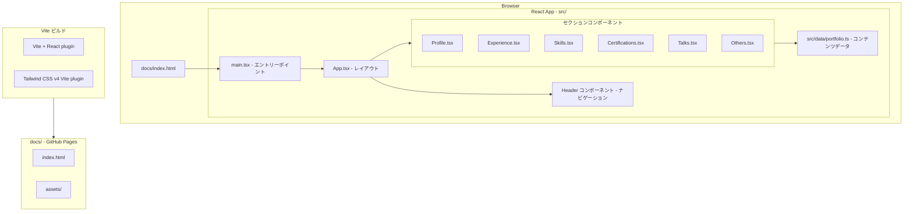
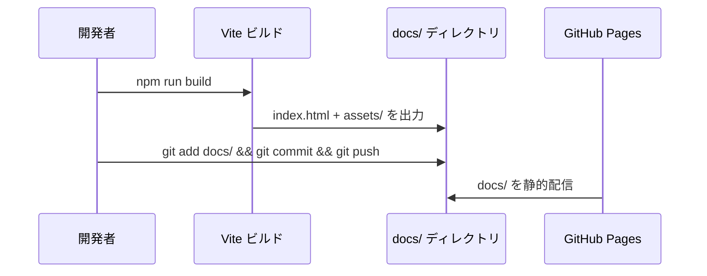
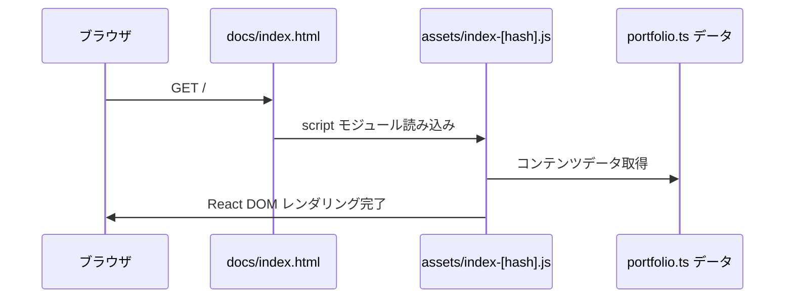
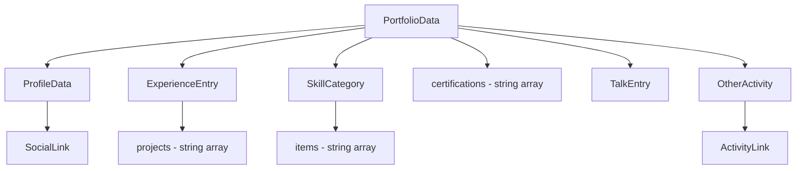
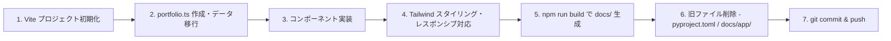

# Design Document: react-rewrite

## Overview

本フィーチャーは、stlite（WebAssembly）ベースの Streamlit ポートフォリオサイトを Vite + React + TypeScript 製の静的サイトとして完全に書き直す。ビルド成果物を `docs/` ディレクトリに出力することで GitHub Pages との互換性を維持し、WebAssembly ランタイムを排除して初回表示を高速化する。

対象ユーザーは採用担当者・クライアント・データエンジニアリングコミュニティのメンバーであり、プロフィール・職歴・スキル・資格・登壇履歴・その他活動を単一ページで閲覧できる。

既存の `docs/app/main.py`（89 行）に含まれるコンテンツデータをすべて `src/data/portfolio.ts` に移行し、React コンポーネントとして再実装する。Python / stlite に関連するすべての依存・設定ファイルは削除する。

### Goals

- Vite + React + TypeScript によるビルド環境を構築し、`docs/` に静的ファイルを出力する
- 現行サイトのすべてのコンテンツセクション（プロフィール・職歴・スキル・資格・登壇・その他）を完全移行する
- レスポンシブレイアウト・セマンティック HTML・アクセシビリティを満たす
- WebAssembly ランタイム不要による高速な初回表示を実現する

### Non-Goals

- GitHub Actions による自動デプロイ（`docs/` の git 管理による手動デプロイを継続する）
- ブログ・コメント・検索などの追加機能
- React Router によるマルチページ構成（単一スクロールページを維持する）
- テスト自動化インフラの構築（本フェーズのスコープ外）
- Python ツールチェーン（pyproject.toml / uv.lock / Ruff）の維持

---

## Architecture

### Existing Architecture Analysis

現行サイトは `docs/index.html` が stlite を CDN 経由で読み込み、`docs/app/main.py` の Streamlit スクリプトを WebAssembly 上で実行する構成である。React への書き直しはこの構成を完全に置き換える。

- 維持される点: `docs/` を GitHub Pages で公開するデプロイ方式、ドメイン（ugmuka.github.io）
- 廃止される点: stlite CDN 依存、Pyodide WebAssembly ランタイム、Python パッケージ管理（uv / pyproject.toml）、`docs/app/main.py`
- 移行データ: `main.py` 内のすべてのコンテンツ定数（NAME / EMAIL / SOCIAL_MEDIA / 職歴 / スキル / 資格 / 登壇 / その他）

### Architecture Pattern & Boundary Map

本フィーチャーは**コンポーネントベース SPA（Component-Based SPA）**パターンを採用する。単一の `index.html` から React アプリケーションをマウントし、セクション単位のコンポーネントをスクロールで閲覧する構成とする。ルーティングライブラリは使用しない。



- 選択パターン: Component-Based SPA（React Router なし）
  - 理由: ポートフォリオはコンテンツ更新のみで機能し、ページ遷移が不要。依存を最小化する
- ドメイン境界: コンテンツデータ（`src/data/`）と UI（`src/components/`）を明確に分離し、データ変更が UI に波及しない構造とする
- 新規コンポーネントの根拠: 各セクションは独立したコンテンツ単位であり、`main.py` の `st.header` 区切りに対応する

### Technology Stack

| Layer | 選択 / バージョン | 役割 | 備考 |
|-------|-----------------|------|------|
| UI フレームワーク | React 19 | コンポーネントレンダリング | npm create vite テンプレートが同梱 |
| 言語 | TypeScript 5.x | 型安全なコード記述 | react-ts テンプレートで設定済み |
| ビルドツール | Vite 6.x | バンドル・開発サーバー | `build.outDir: 'docs'` で直接出力 |
| スタイリング | Tailwind CSS v4 + @tailwindcss/vite | ユーティリティクラスによるスタイリング | v4 は PostCSS 設定不要、Vite プラグインのみ |
| ナビゲーション | CSS `scroll-behavior: smooth` + `<a href="#id">` | セクション間スムーズスクロール | React Router / 外部ライブラリ不使用 |
| ホスティング | GitHub Pages（`docs/` ブランチ） | 静的ファイル公開 | 現行デプロイ方式を継続 |
| パッケージ管理 | npm | 依存管理・スクリプト実行 | Node.js LTS（DevContainer 既存） |

---

## System Flows

### ビルド・デプロイフロー



### ページレンダリングフロー



---

## Requirements Traceability

| 要件 | 概要 | 担当コンポーネント | インターフェース | フロー |
|------|------|------------------|----------------|--------|
| 1.1 | `docs/` へのビルド出力 | Vite 設定 | `build.outDir: 'docs'` | ビルド・デプロイフロー |
| 1.2 | 静的 HTML/CSS/JS 生成 | Vite ビルド | `base: '/'` | ビルド・デプロイフロー |
| 1.3 | ビルド成功・`docs/index.html` 生成 | Vite ビルド | `npm run build` | ビルド・デプロイフロー |
| 1.4 | ビルドエラーのコンソール出力 | Vite デフォルト動作 | - | - |
| 1.5 | Python / stlite / WebAssembly 依存なし | プロジェクト全体 | pyproject.toml 削除 | - |
| 2.1 | 氏名・職種・メールアドレス表示 | Profile | `ProfileData` 型 | - |
| 2.2 | SNS リンク表示 | Profile | `SocialLink` 型 | - |
| 2.3 | SNS リンクを新タブで開く | Profile | `target="_blank"` | - |
| 2.4 | メールアドレスを `mailto:` リンク | Profile | `href="mailto:..."` | - |
| 3.1 | 勤務先・職種・在籍期間表示 | Experience | `ExperienceData` 型 | - |
| 3.2 | プロジェクト一覧リスト表示 | Experience | `string[]` | - |
| 3.3 | 7 件以上のプロジェクト | portfolio.ts | `ExperienceData.projects` | - |
| 4.1 | スキルカテゴリ別表示 | Skills | `SkillCategory` 型 | - |
| 4.2 | 現行サイトと同等のスキル項目 | Skills + portfolio.ts | `SkillCategory[]` | - |
| 4.3 | スキル項目リスト表示 | Skills | `string[]` | - |
| 5.1 | 資格リスト表示 | Certifications | `string[]` | - |
| 5.2 | 5 件の資格すべて含む | portfolio.ts | `certifications: string[]` | - |
| 6.1 | 登壇履歴テーブル表示 | Talks | `TalkEntry` 型 | - |
| 6.2 | 資料リンクをクリック可能に | Talks | `TalkEntry.slideUrl` | - |
| 6.3 | 資料リンクを新タブで開く | Talks | `target="_blank"` | - |
| 6.4 | 4 件の登壇履歴すべて含む | portfolio.ts | `talks: TalkEntry[]` | - |
| 7.1 | その他活動を文章で表示 | Others | `OtherActivity` 型 | - |
| 7.2 | 外部プロダクトリンクを新タブで開く | Others | `target="_blank"` | - |
| 8.1 | デスクトップ・モバイル両対応 | App + 全セクション | Tailwind レスポンシブ prefix | - |
| 8.2 | モバイルでのはみ出し防止 | App + 全セクション | `overflow-x-hidden`, `max-w-full` | - |
| 8.3 | セクション間ナビゲーション | Header | `<a href="#section-id">` | - |
| 9.1 | WebAssembly 不要・高速表示 | ビルド全体 | Vite バンドル最適化 | ページレンダリングフロー |
| 9.2 | 代替テキスト付与 | 全コンポーネント | `alt` 属性 | - |
| 9.3 | セマンティック HTML 使用 | App + 全セクション | `<header>`, `<main>`, `<section>`, `<nav>` | - |

---

## Components and Interfaces

### コンポーネントサマリー

| コンポーネント | レイヤー | 役割 | 要件カバレッジ | 主要依存 | コントラクト |
|--------------|---------|------|--------------|---------|------------|
| `portfolio.ts` | Data | コンテンツデータ定義 | 3.3, 5.2, 6.4 | なし | State |
| `App.tsx` | Layout | ページ全体レイアウト | 8.1, 8.2, 9.3 | 全セクション (P0) | State |
| `Header.tsx` | UI / Navigation | ナビゲーションバー | 8.3, 9.3 | なし | - |
| `Profile.tsx` | UI / Section | プロフィール表示 | 2.1, 2.2, 2.3, 2.4 | `portfolio.ts` (P0) | State |
| `Experience.tsx` | UI / Section | 職歴・プロジェクト表示 | 3.1, 3.2, 3.3 | `portfolio.ts` (P0) | State |
| `Skills.tsx` | UI / Section | スキルマトリクス表示 | 4.1, 4.2, 4.3 | `portfolio.ts` (P0) | State |
| `Certifications.tsx` | UI / Section | 資格一覧表示 | 5.1, 5.2 | `portfolio.ts` (P0) | State |
| `Talks.tsx` | UI / Section | 登壇履歴テーブル表示 | 6.1, 6.2, 6.3, 6.4 | `portfolio.ts` (P0) | State |
| `Others.tsx` | UI / Section | その他活動表示 | 7.1, 7.2 | `portfolio.ts` (P0) | State |

---

### Data Layer

#### `src/data/portfolio.ts`

| Field | Detail |
|-------|--------|
| Intent | `main.py` から移行したポートフォリオコンテンツデータの唯一の定義元 |
| Requirements | 3.3, 5.2, 6.4 |

**Responsibilities & Constraints**

- `main.py` の定数（NAME / EMAIL / SOCIAL_MEDIA / 職歴 / スキル / 資格 / 登壇 / その他）をすべて型付きデータとして保持する
- ランタイム変更なし（コンパイル時定数）
- コンポーネントはこのファイルをインポートする。逆依存は存在しない

**Dependencies**

- なし

**Contracts**: State [x]

##### State Management

```typescript
/** プロフィール基本情報 */
export interface ProfileData {
  name: string;
  role: string;
  email: string;
  socialLinks: SocialLink[];
}

/** SNS リンク */
export interface SocialLink {
  platform: string;
  url: string;
}

/** 職歴エントリ */
export interface ExperienceEntry {
  company: string;
  role: string;
  period: string;       // 表示用文字列 例: "2020/04/01〜現在"
  projects: string[];
}

/** スキルカテゴリ */
export interface SkillCategory {
  category: string;
  items: string[];
}

/** 登壇履歴エントリ */
export interface TalkEntry {
  date: string;         // 表示用文字列 例: "2022/08/23"
  event: string;
  title: string;
  slideUrl: string;
}

/** その他活動エントリ */
export interface OtherActivity {
  description: string;
  links: ActivityLink[];
}

/** 活動内のリンク */
export interface ActivityLink {
  label: string;
  url: string;
}

/** ポートフォリオ全体データ */
export interface PortfolioData {
  profile: ProfileData;
  experiences: ExperienceEntry[];
  skills: SkillCategory[];
  certifications: string[];
  talks: TalkEntry[];
  otherActivities: OtherActivity[];
}
```

- 状態モデル: コンパイル時定数（`const portfolio: PortfolioData`）としてエクスポートする。ランタイム状態管理は不要
- 永続性: ソースコードに直接埋め込む。外部 API 呼び出しなし
- 並行性: なし（静的データ）

**Implementation Notes**

- `main.py` のすべての定数・マークダウンテキストを対応する型フィールドに移行する
- `SOCIAL_MEDIA` の順序（X / LinkedIn / Qiita / Zenn / SpeakerDeck）を維持する
- 登壇履歴の `slideUrl` は既存 SpeakerDeck URL をそのまま使用する

---

### Layout Layer

#### `src/App.tsx`

| Field | Detail |
|-------|--------|
| Intent | ページ全体のレイアウトを定義し、`<header>`, `<main>`, `<footer>` のセマンティック構造を提供する |
| Requirements | 8.1, 8.2, 9.3 |

**Responsibilities & Constraints**

- `Header` と全セクションコンポーネントをレイアウトに配置する
- レスポンシブ幅制御（最大幅コンテナ）を担当する
- セクション `id` 属性を付与し、ナビゲーションアンカーの対象とする

**Dependencies**

- Inbound: なし
- Outbound: Header, Profile, Experience, Skills, Certifications, Talks, Others — セクションレンダリング (P0)

**Contracts**: State [x]

##### State Management

```typescript
// App は状態を持たない。セクションコンポーネントを並べて返す純粋なレイアウトコンポーネント
const App: React.FC = () => JSX.Element;
```

- セクション ID の命名規則: `profile`, `experience`, `skills`, `certifications`, `talks`, `others`
- `<html>` に `scroll-behavior: smooth` を適用し、外部ライブラリなしでスムーズスクロールを実現する

---

### UI / Navigation Layer

#### `src/components/Header.tsx`

| Field | Detail |
|-------|--------|
| Intent | ページ内アンカーリンクを提供するナビゲーションバー |
| Requirements | 8.3, 9.3 |

**Responsibilities & Constraints**

- `<header>` + `<nav>` セマンティック要素を使用する
- モバイルではハンバーガーメニューまたはスクロールメニューに切り替える
- 外部リンクを含まない（すべてページ内アンカー `#id`）

**Dependencies**

- Inbound: App (P0)
- Outbound: なし

**Contracts**: State [x]

##### State Management

```typescript
interface NavItem {
  label: string;
  targetId: string;   // アンカー先のセクション ID
}

// モバイルメニュー開閉状態のみローカル State として管理
const Header: React.FC = () => JSX.Element;
```

**Implementation Notes**

- モバイル表示時のメニュー開閉は `useState<boolean>` でローカル管理する
- `aria-label` / `aria-expanded` を付与してアクセシビリティを確保する

---

### UI / Section Layer

以下の 6 セクションコンポーネントはすべて `portfolio.ts` の対応データをインポートし、状態を持たない純粋な表示コンポーネントである。新しいドメイン境界を導入しないため、サマリーレベルの記述とする。

#### `src/components/Profile.tsx`

**Intent**: プロフィール（氏名・職種・メール・SNS リンク）を表示する  
**Requirements**: 2.1, 2.2, 2.3, 2.4  

```typescript
// ProfileData を portfolio.ts から直接インポートして使用する（props 不要）
const Profile: React.FC = () => JSX.Element;
```

**Implementation Notes**

- `<section id="profile">` でラップする
- SNS リンクおよびメールアドレスには `target="_blank" rel="noopener noreferrer"` を付与する
- メールアドレスは `href="mailto:ugmuka1@gmail.com"` として表示する

---

#### `src/components/Experience.tsx`

**Intent**: 職歴（勤務先・職種・在籍期間）とプロジェクト一覧を表示する  
**Requirements**: 3.1, 3.2, 3.3  

```typescript
const Experience: React.FC = () => JSX.Element;
```

**Implementation Notes**

- `<section id="experience">` でラップする
- `ExperienceEntry.projects` を `<ul>` / `<li>` でリスト表示する

---

#### `src/components/Skills.tsx`

**Intent**: スキルをカテゴリ別に表示する  
**Requirements**: 4.1, 4.2, 4.3  

```typescript
const Skills: React.FC = () => JSX.Element;
```

**Implementation Notes**

- `<section id="skills">` でラップする
- `SkillCategory[]` を `map` でレンダリングし、各カテゴリを `<h3>` + `<ul>` で表示する

---

#### `src/components/Certifications.tsx`

**Intent**: 取得資格の一覧をリスト表示する  
**Requirements**: 5.1, 5.2  

```typescript
const Certifications: React.FC = () => JSX.Element;
```

**Implementation Notes**

- `<section id="certifications">` でラップする
- `certifications: string[]` を `<ul>` / `<li>` でレンダリングする

---

#### `src/components/Talks.tsx`

**Intent**: 登壇履歴をテーブル形式で表示し、資料リンクを提供する  
**Requirements**: 6.1, 6.2, 6.3, 6.4  

```typescript
const Talks: React.FC = () => JSX.Element;
```

**Implementation Notes**

- `<section id="talks">` でラップする
- `<table>` を使用して日付・イベント・タイトル・資料リンクを表示する
- モバイルでは横スクロール可能なコンテナ（`overflow-x-auto`）で囲む
- 資料リンクは `target="_blank" rel="noopener noreferrer"` を付与する

---

#### `src/components/Others.tsx`

**Intent**: 職歴外の開発活動を文章形式で表示する  
**Requirements**: 7.1, 7.2  

```typescript
const Others: React.FC = () => JSX.Element;
```

**Implementation Notes**

- `<section id="others">` でラップする
- `OtherActivity.links` の外部リンクは `target="_blank" rel="noopener noreferrer"` を付与する

---

## Data Models

### Domain Model

ポートフォリオデータは単一のルート集約（`PortfolioData`）として定義する。コンテンツはすべて値オブジェクトであり、ランタイムの変更・永続化は発生しない。



- 不変条件: `PortfolioData` はビルド時に確定し、ランタイムで変更されない
- すべてのフィールドは `string` または `string[]`、またはそれらを持つオブジェクトの配列である

### Logical Data Model

外部 API・データベース・ストレージは使用しない。データはソースコード内の TypeScript 定数として定義される。型定義は `src/data/portfolio.ts` の `PortfolioData` インターフェースが唯一の正規表現である（Components and Interfaces 節の State Management を参照）。

---

## Error Handling

### Error Strategy

本サイトはランタイムデータ取得・認証・フォーム送信を持たないため、エラーハンドリングは最小限とする。

### Error Categories and Responses

**ビルドエラー**: TypeScript 型エラーまたは Vite ビルドエラー → コンソールにエラーを出力しビルドを中断する（要件 1.4）。CI がない場合は開発者が手動で確認する。

**リンク切れ（外部 URL）**: SNS リンク・登壇資料リンクが変更された場合 → `portfolio.ts` を直接編集して修正する。エラーの自動検知は本フェーズのスコープ外。

**ブラウザ非対応**: Vite ビルドのデフォルトターゲット（モダンブラウザ）に非対応な場合 → ビルド設定の `build.target` で調整する。

### Monitoring

本フェーズではモニタリング基盤を導入しない。GitHub Pages の静的サイトとして運用するため、外部エラートラッキングは不要。

---

## Testing Strategy

### Unit Tests

本フェーズではテスト自動化インフラを構築しない（Non-Goals）。以下は将来のフェーズで追加すべき対象として記録する。

- `portfolio.ts` のデータ完全性検証（必須フィールドの欠損チェック）
- 各セクションコンポーネントのスナップショットテスト
- `Header` のモバイルメニュー開閉ロジック

### E2E / Manual Tests

実装後の手動検証として以下を実施する。

1. `npm run build` が成功し、`docs/index.html` が生成される（要件 1.3）
2. `http-server` でローカル確認し、全セクションが表示される（要件 2〜7）
3. モバイル幅（375px）でレイアウト崩れがないことをブラウザ DevTools で確認する（要件 8）
4. すべての外部リンクが新タブで開くことを確認する（要件 2.3, 6.3, 7.2）
5. スクリーンリーダーツールでセマンティック構造を確認する（要件 9.3）

---

## Optional Sections

### Performance & Scalability

- **目標**: 初回ロード時に stlite 相当（数十 MB の WebAssembly）をダウンロードしない。Vite バンドルは通常数百 KB 以下に収まるため、大幅な改善が見込まれる（要件 9.1）
- **コード分割**: 単一ページ構成のためコード分割は不要。すべてのセクションをメインバンドルに含める
- **画像**: 本フェーズで画像アセットを追加する予定はない。追加する場合は `public/` ディレクトリに配置し、適切な `alt` 属性を付与する（要件 9.2）

### Migration Strategy



- **ロールバックトリガー**: ビルドが失敗するまたはコンテンツが欠損する場合は、`git revert` で旧 `docs/` に戻す
- **ブランチ戦略**: 実装は feature ブランチで進め、`docs/` 出力の確認後に main にマージする
- **削除対象ファイル**: `docs/app/main.py`, `docs/app/`, `pyproject.toml`, `uv.lock`, `Makefile`（`http-server` 用 init コマンドのみ含む場合）
- **更新対象ファイル**: `docs/index.html`（Vite ビルド出力が上書き）、`.kiro/steering/tech.md`（スタック更新反映）

### Security Considerations

- 外部リンク（SNS・登壇資料）には `rel="noopener noreferrer"` を必ず付与し、タブナビゲーション攻撃（reverse tabnapping）を防止する
- コンテンツはすべて静的定数であるため、XSS・インジェクション攻撃の対象外

---

## Supporting References

- Vite 公式デプロイガイド: https://vite.dev/guide/static-deploy
- Tailwind CSS v4 公式: https://tailwindcss.com/blog/tailwindcss-v4
- `@tailwindcss/vite` npm: https://www.npmjs.com/package/@tailwindcss/vite
